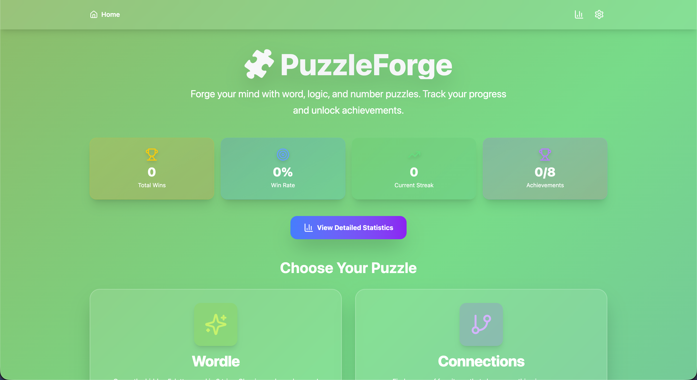
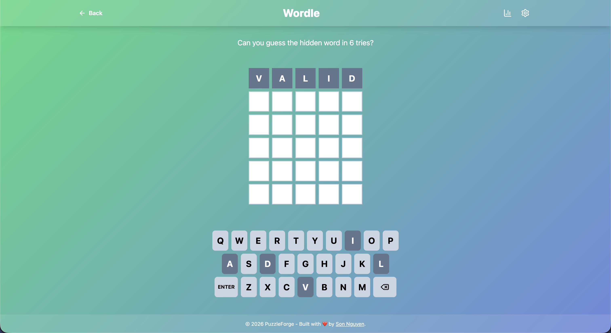
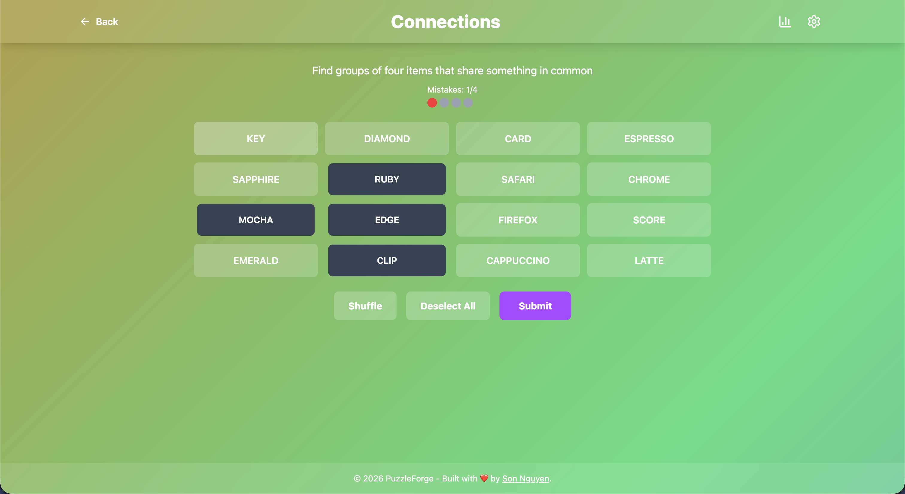
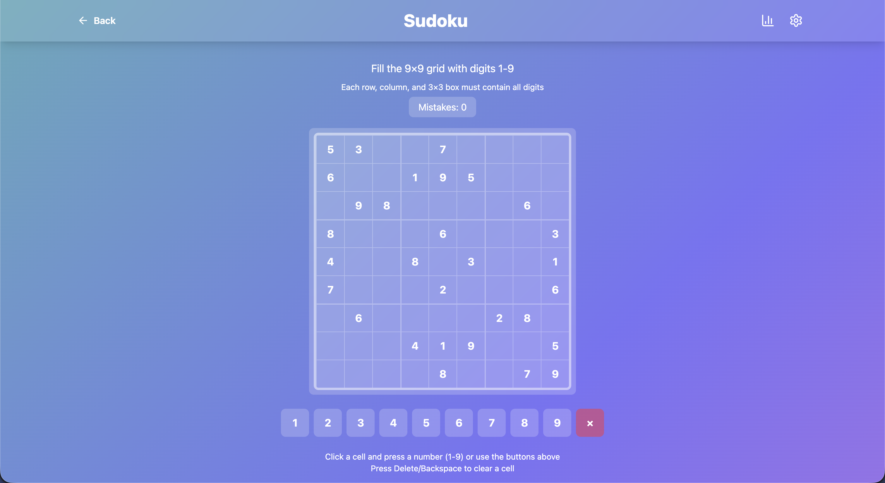
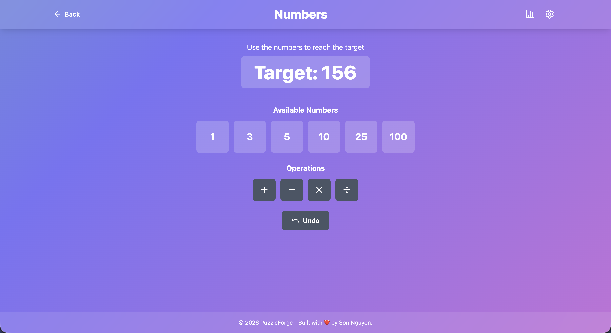
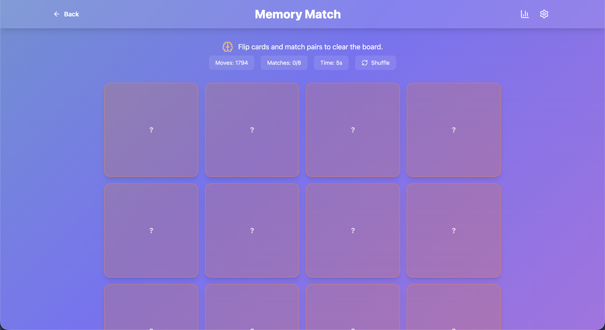
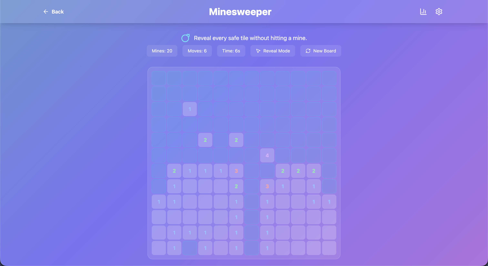
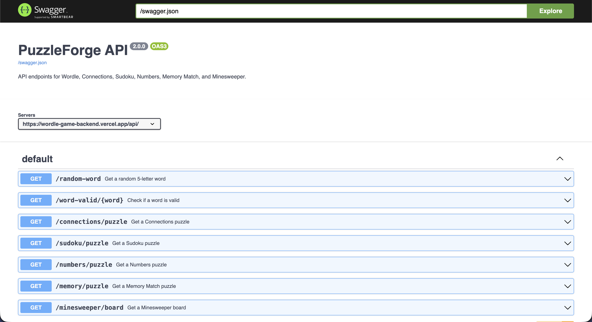
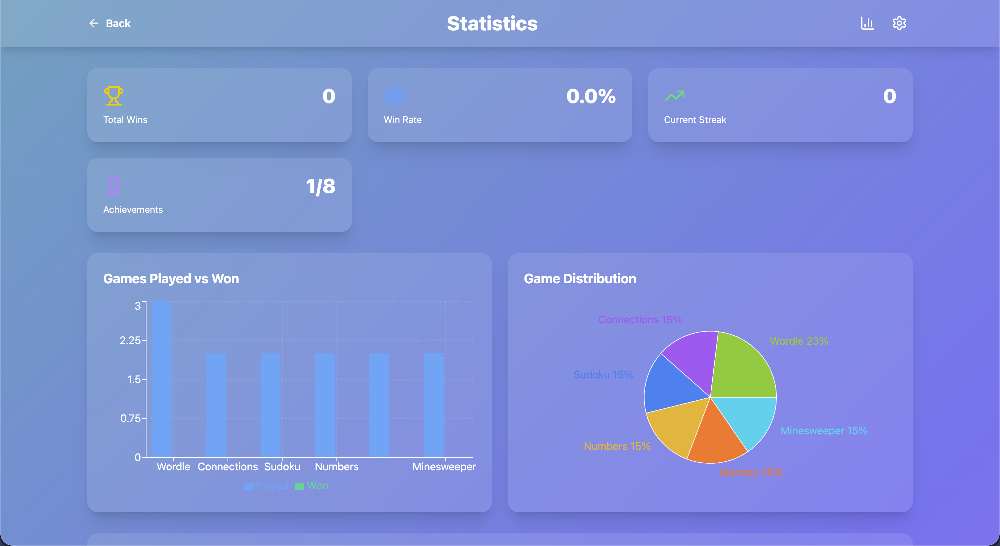
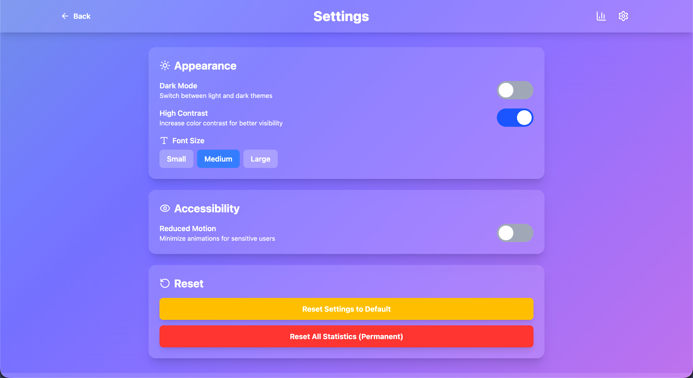

# 🧩 PuzzleForge - Production-Ready Multi-Game Platform

PuzzleForge is a comprehensive collection of puzzle games built with React, TypeScript, and modern web technologies. This project transforms a simple Wordle clone into a full-featured gaming platform with multiple games, statistics tracking, and a polished user experience.

- **Frontend**: React 19 + TypeScript + Tailwind CSS 4 + React Router
- **Backend**: Express API with comprehensive endpoints for all games
- **Deployment**: Production-ready monorepo deployed on Vercel
- **Games**: Wordle, Connections, Sudoku, Numbers, Memory Match, and Minesweeper

## 🎯 Live Demo

**Play PuzzleForge: [https://puzzlesforge.vercel.app/](https://puzzlesforge.vercel.app/)**

<p align="center">
  
  
  
  
  
  
  
  
  
  
  
  
  
  
</p>

## 🎮 Available Games

<p align="center">
  
</p>

### 1. Wordle

Classic word-guessing game where you have 6 attempts to guess a 5-letter word. Each guess provides color-coded feedback.

<p align="center">
  
</p>

**Features:**

- 5-letter word validation via API
- Color-coded feedback (correct, wrong position, not in word)
- On-screen keyboard with state tracking
- Physical keyboard support
- Win/loss tracking with localStorage

### 2. Connections

Find groups of four items that share something in common. Inspired by NYT's Connections game.

<p align="center">
  
</p>

**Features:**

- 4 categories with varying difficulty levels
- Color-coded difficulty (Easy, Medium, Hard, Tricky)
- "One away" hints
- Mistake tracking (4 mistakes max)
- Shuffle and deselect functionality
- Dynamic puzzle generation

### 3. Sudoku

Fill a 9×9 grid with digits 1-9 such that each row, column, and 3×3 box contains all digits.

<p align="center">
  
</p>

**Features:**

- Classic 9×9 Sudoku puzzles
- Visual highlighting for selected cells
- Keyboard and mouse input support
- Real-time validation
- Mistake tracking
- Pre-filled cells are locked

### 4. Numbers

Use mathematical operations (+, -, ×, ÷) to reach a target number from a set of given numbers.

<p align="center">
  
</p>

**Features:**

- 6 numbers to work with
- All four basic operations
- Undo functionality
- Operation history tracking
- Division requires whole number results
- Multiple difficulty levels

### 5. Memory Match

Flip cards and match pairs to clear the board with the fewest moves.

<p align="center">
  
</p>

**Features:**

- Difficulty-based board sizes
- Move counter and timer
- Smooth flip/match feedback
- Instant reshuffle for a new puzzle

### 6. Minesweeper

Reveal safe tiles, flag mines, and clear the grid without detonating.

<p align="center">
  
</p>

**Features:**

- Difficulty-based minefields
- Flag mode for mobile-friendly play
- Move counter and timer
- Classic adjacency hints

## 🚀 Tech Stack

### Frontend

- **React 19** - Latest React with concurrent features
- **TypeScript 5.6+** - Type-safe development
- **Tailwind CSS 4** - Utility-first styling
- **React Router 6** - Client-side routing
- **Vite 6** - Lightning-fast build tool
- **Lucide React** - Beautiful icon library
- **Vercel Analytics** - Usage tracking

### Backend

- **Node.js** - JavaScript runtime
- **Express** - Web application framework
- **TypeScript** - Type-safe backend code
- **Undici** - Fast HTTP client
- **CORS** - Cross-origin resource sharing
- **OpenAPI 3.0** - API documentation standard

### Production Features

- **Error Boundaries** - Graceful error handling
- **Loading States** - User feedback during API calls
- **Local Storage** - Statistics persistence
- **Responsive Design** - Mobile-first approach
- **SEO Optimized** - Meta tags and semantic HTML
- **PWA Ready** - Service worker and manifest

## 📁 Project Structure

```
/
├── backend/
│   ├── index.ts              # Express API + all game endpoints
│   ├── favicon.ico           # API favicon
│   ├── package.json          # Backend dependencies
│   ├── tsconfig.json         # TypeScript config
│   └── vercel.json           # Serverless deployment config
│
├── src/
│   ├── components/           # Shared components
│   │   ├── ErrorBoundary.tsx # Error handling component
│   │   ├── Layout.tsx        # Page layout with navigation
│   │   ├── GameCard.tsx      # Game selection card
│   │   └── LoadingSpinner.tsx # Loading indicator
│   │
│   ├── pages/                # Game pages
│   │   ├── Home.tsx          # Home page with game selection
│   │   ├── WordleGame.tsx    # Wordle game logic
│   │   ├── ConnectionsGame.tsx # Connections game logic
│   │   ├── SudokuGame.tsx    # Sudoku game logic
│   │   ├── NumbersGame.tsx   # Numbers game logic
│   │   ├── MemoryGame.tsx    # Memory Match game logic
│   │   └── MinesweeperGame.tsx # Minesweeper game logic
│   │
│   ├── (Wordle components)   # Wordle components
│   │   ├── TileRow.tsx       # Row of 5 tiles
│   │   ├── Tile.tsx          # Individual tile
│   │   ├── Keyboard.tsx      # On-screen keyboard
│   │   ├── GameWon.tsx       # Victory screen
│   │   └── GameOver.tsx      # Game over screen
│   │
│   ├── App.tsx               # Router configuration
│   └── main.tsx              # Application entry point
│
├── public/                   # Static assets
│   ├── manifest.json         # PWA manifest
│   └── (favicon files)       # App icons
│
├── package.json              # Frontend dependencies
├── vite.config.ts            # Vite configuration
├── tsconfig.json             # TypeScript config
└── README.md                 # This file
```

## 🛠️ Development

### Prerequisites

- **Node.js** v16+
- **npm** or **yarn**
- (Optional) **Vercel CLI** for deployment

### Installation

```bash
# Clone the repository
git clone <your-repo-url>
cd puzzleforge

# Install frontend dependencies
npm install

# Install backend dependencies
cd backend
npm install
cd ..
```

### Running Locally

#### Frontend Development Server

```bash
# From project root
npm run dev
```

Opens at [http://localhost:4260](http://localhost:4260)

#### Backend API Server

```bash
# From backend directory
cd backend
npm run build    # Compile TypeScript
npm start        # Start Express server
```

Runs at [http://localhost:3001](http://localhost:3001)

### Building for Production

```bash
# Frontend build
npm run build
# Output: dist/

# Backend build
cd backend
npm run build
# Output: backend/dist/
```

## 📖 API Documentation

### Live API Docs

- **Swagger UI**: [https://wordle-game-backend.vercel.app/api-docs](https://wordle-game-backend.vercel.app/api-docs)
- **OpenAPI Spec**: [https://wordle-game-backend.vercel.app/swagger.json](https://wordle-game-backend.vercel.app/swagger.json)

<p align="center">
  
</p>

### Endpoints

| Method | Path                      | Description              | Response                                                        |
| ------ | ------------------------- | ------------------------ | --------------------------------------------------------------- |
| GET    | `/api/random-word`        | Get random 5-letter word | `{ "word": "apple" }`                                           |
| GET    | `/api/word-valid/:word`   | Validate word            | `{ "valid": true }`                                             |
| GET    | `/api/connections/puzzle` | Get Connections puzzle   | `{ "groups": [...] }`                                           |
| GET    | `/api/sudoku/puzzle`      | Get Sudoku puzzle        | `{ "puzzle": [...], "solution": [...] }`                        |
| GET    | `/api/numbers/puzzle`     | Get Numbers puzzle       | `{ "numbers": [...], "target": 347 }`                           |
| GET    | `/api/memory/puzzle`      | Get Memory Match puzzle  | `{ "pairs": [...], "difficulty": "medium" }`                    |
| GET    | `/api/minesweeper/board`  | Get Minesweeper board    | `{ "width": 9, "height": 9, "minesCount": 10, "mines": [...] }` |

### Example API Calls

```bash
# Get a random word for Wordle
curl https://wordle-game-backend.vercel.app/api/random-word

# Validate a word
curl https://wordle-game-backend.vercel.app/api/word-valid/hello

# Get a Connections puzzle
curl https://wordle-game-backend.vercel.app/api/connections/puzzle

# Get a Sudoku puzzle
curl https://wordle-game-backend.vercel.app/api/sudoku/puzzle

# Get a Numbers puzzle
curl https://wordle-game-backend.vercel.app/api/numbers/puzzle

# Get a Memory Match puzzle
curl https://wordle-game-backend.vercel.app/api/memory/puzzle

# Get a Minesweeper board
curl https://wordle-game-backend.vercel.app/api/minesweeper/board
```

## 🎨 Design Features

### Gradient Background Animation

All pages feature a beautiful animated gradient background that transitions smoothly between colors:

- Pink (#ff6ec4)
- Purple (#7873f5)
- Green (#4ade80)
- Orange (#f97316)

### Consistent Styling

- Glass morphism effects (backdrop blur)
- Rounded corners and shadows
- Responsive design for all screen sizes
- Accessible color contrasts
- Smooth transitions and animations

### Color Coding

- **Lime Green** - Correct (Wordle) / Easy (Connections)
- **Yellow** - Wrong position (Wordle) / Medium (Connections)
- **Orange** - Hard difficulty (Connections)
- **Purple** - Tricky difficulty (Connections)
- **Blue** - Sudoku selections
- **Various** - Numbers game operations

## 📊 Statistics Tracking

Game statistics are stored in browser localStorage (via Zustand persistence):

- Wordle performance and streaks
- Connections accuracy
- Sudoku completion stats
- Numbers solve stats
- Memory Match results
- Minesweeper results

View your stats on the home page or the dedicated, detailed statistics page.

<p align="center">
  
</p>

## ⚙️ Settings

Customize your experience with various settings:

- Reduced motion mode
- Font size adjustment
- High contrast mode
- Choose color themes (light/dark/system)
- Reset statistics

<p align="center">
  
</p>

## 🚀 Deployment

### Vercel Deployment (Recommended)

```bash
# Install Vercel CLI
npm i -g vercel

# Deploy
vercel --prod
```

The monorepo structure automatically deploys:

- Frontend as a React web app
- Backend as serverless functions

### Manual Deployment

1. Build frontend: `npm run build`
2. Build backend: `cd backend && npm run build`
3. Deploy `dist/` to static hosting
4. Deploy `backend/` to Node.js hosting

## 🧪 Testing

```bash
# Run tests (if configured)
npm test

# Type checking
npm run build

# Linting
npm run lint

# Format code
npm run format
```

## 🔧 Configuration

### Environment Variables

No environment variables required! The app works out of the box.

Optional:

- `PORT` - Backend server port (default: 3001)

### Customization

#### Add More Games

1. Create game component in `src/pages/`
2. Add route in `src/App.tsx`
3. Add API endpoint in `backend/index.ts`
4. Add game card to `src/pages/Home.tsx`

#### Change Styling

- Modify gradient colors in Layout component
- Update Tailwind classes in components
- Adjust `styles.css` for global styles

## 📝 License

This project is licensed under the MIT License. See the [LICENSE](LICENSE) file for details.

## 💻 Author

**Son Nguyen**

- GitHub: [@hoangsonww](https://github.com/hoangsonww)
- Website: [https://sonnguyenhoang.com](https://sonnguyenhoang.com)

## 🙏 Acknowledgments

- Original Wordle game by Josh Wardle
- NYT Connections for game inspiration
- React and TypeScript communities
- Vercel for hosting platform

## 🤝 Contributing

Contributions are welcome! Please feel free to submit a Pull Request.

1. Fork the project
2. Create your feature branch (`git checkout -b feature/AmazingFeature`)
3. Commit your changes (`git commit -m 'Add some AmazingFeature'`)
4. Push to the branch (`git push origin feature/AmazingFeature`)
5. Open a Pull Request

## 📫 Support

For issues, questions, or suggestions:

- Open an issue on your Git hosting provider
- Contact via email: info@example.com

---

<p align="center">Made with ❤️ by Son Nguyen</p>
<p align="center">⭐ Star this repo if you find it helpful!</p>
